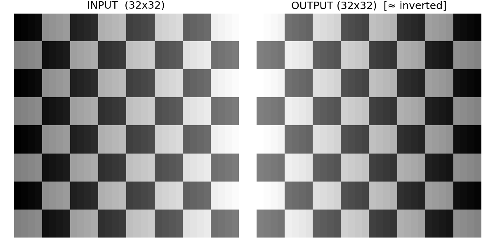

# KTH IS1200 Mini Project(Group 93)

An embedded systems mini‑project for the KTH course IS1200 (Computer Hardware Engineering). The project combines C and assembly with a custom linker script and a Makefile‑driven toolchain. Utility scripts in Python and Shell are included to streamline development tasks.

This project implements an image processor on a RISC-V board. The processor supports the following image transformations:
- **Inversion**: Inverts the colors of the image.
- **Brightening**: Increases the brightness of the image.
- **Darkening**: Decreases the brightness of the image.

## Tech stack

- C (47.4%) — main application logic and drivers
- Assembly (29.1%) — low‑level routines, startup, and performance‑critical paths
- Python (15.1%) — tooling (e.g., asset generation, preprocessing)
- Linker Script (3.0%) — memory layout and section placement
- Makefile (2.8%) — build orchestration
- Shell (2.6%) — convenience scripts and automation

## Features
This project provides a complete hardware-accelerated image processing workflow on a bare-metal RISC-V system.
### Core Functionality
- **Interactive** Host-to-Board Workflow: Upload images directly from a host PC to the board's SDRAM. The processing is triggered on-demand by writing to a specific memory address.
- **On-Board** Image Transformations: Performs image processing tasks (such as inversion, brightening, and darkening) directly on the hardware for maximum performance.
- **Live VGA Display**: Instantly visualizes the original or processed image on a connected VGA monitor, providing real-time visual feedback.
- **Result Verification**: Download the processed image from the board's memory back to the host PC using the dtekv-download utility for analysis and verification.


## Quick Start

## Running
### Demo
If you want to see the whole, please run these code:
```bash
source demo.sh
```

In order to run the code, you can use the single instructions below:
### Requirments
make sure that your computer is running Jtagd. If not, please run the code below:
```bash
jtagd
```

### Generate images
please use the `gen_img.py` script to generate images. The instruction that you can use is: 
```bash
python gen_img.py
```
### Upload images
Uploadding the images just need a single instruction:
```bash
# 上传输入
dtekv-upload img.bin 0x02000000

# 写长度（例：1024 = 0x00000400，小端）
# 方式1：printf 到文件（最简单）
printf '\x00\x04\x00\x00' > len.bin     # 1024 的 LE32：00 04 00 00
ls -l len.bin                           # 必须是 4 字节
xxd len.bin
dtekv-upload len.bin 0x0200FFF0
```
### Run the main script
In order to run the main script, you can use this command:
```bash
# You need to wait until the main process is done!

dtekv-run main.bin 
```
After every thing is down, please print `Ctrl+C` to exit.

### Download the processed images
If you want to download the processed images, you can use the command that:
```bash
# 下载输出（这步不要 Ctrl+C！等它结束）
dtekv-download out.bin 0x02010000 1024

# 验证文件
ls -lh out.bin
hexdump -C out.bin | head
```

### Visualize the results
If you want to make a constraction of the original image and the processed image, please use this command: 
```bash
# python viz_img.py --save output_img.png
python viz_img.py
```
